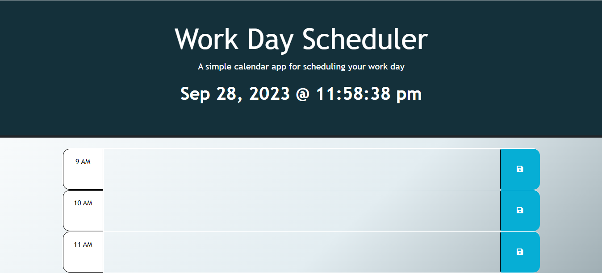

# work-day-scheduler

Further working on my javascript, still trying to work on local storage and get the correct logic to add functionality

## Description

A basic task manager

## Usage

Ideally supposed to enter tasks for your workday, click the button in the blue box that would save your tasks to your local storage. Couldn't get the color coding right to visually show what tasks where due, tasks that need to get done and tasks you finished.

## License

No license used
